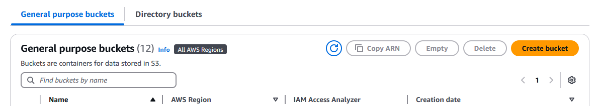
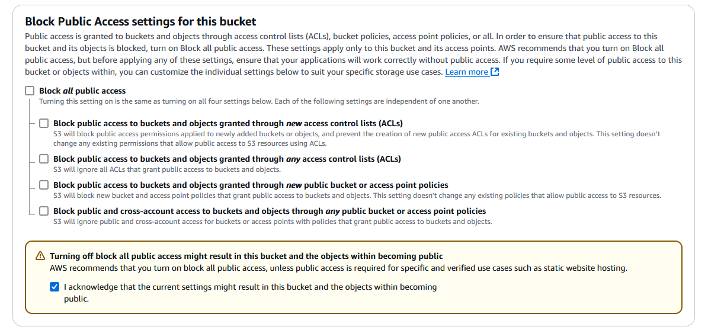
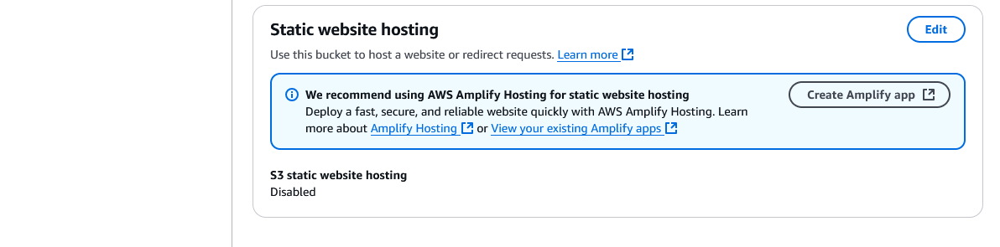
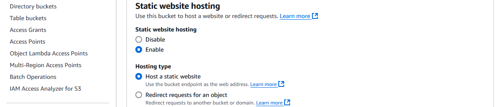
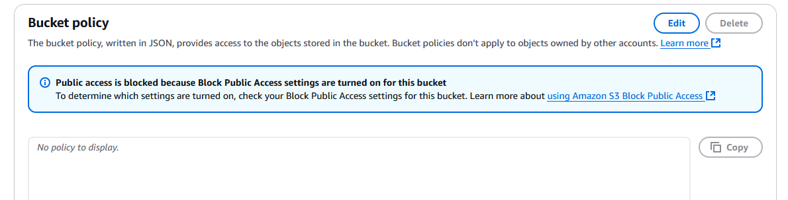
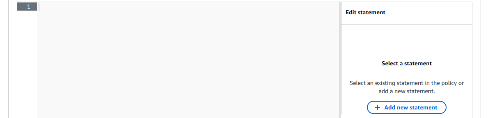
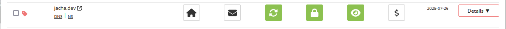
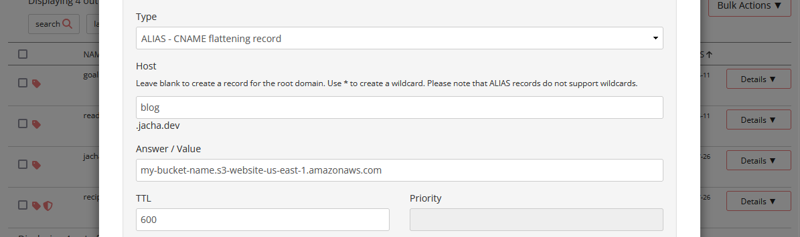

I built the site, signed up for a domain on [Porkbun](https://porkbun.com/). Now what? Should I do managed hosting with Blue Host or Hostinger, et. al.? Should I pay a questionable certificate authority to sign my public key for HTTPS? The answer I submit to you is no and no. I like to get my hands dirty, and plus for some reason I have a bit more confidence in [Amazon Web Services](https://aws.amazon.com/) than [Let's Encrypt](https://letsencrypt.org/).

For the sake of organization, I will be splitting this topic into three separate posts, each centered around a different AWS service that is involved.

See the other posts:
- **Part 1: Static website hosting using AWS S3.**
- [Part 2: HTTPS to an S3 origin the right way using AWS Cloudfront.](/2025-01-21-aws-deploy-a-static-site-with-https-part-2.html)
- [Part 3: Synchronize the dev environment to S3 buckets using AWS CLI.](/2025-01-25-aws-deploy-a-static-site-with-https-part-3.html)

## Pricing

But what about costs? Realistically as a small-time blogger (at least for now), the chance of getting hit with a denial of service attack is slim. But if that's the worry, then [AWS Shield](https://aws.amazon.com/shield/) offers standard DDoS protection by default. It only costs 2.5 cents for the first 100 TB out of Cloudfront. Otherwise, [Cloudflare](https://www.cloudflare.com/plans/) offers unmetered DDoS protection for free. 

Besides that, [AWS S3](https://aws.amazon.com/s3/pricing/) offers file storage and static site hosting for all of 2.3 cents per GB / month for storage, 0.5 cents per 1,000 PUT requests, and 0.04 cents per 1,000 GET requests. My built Astro `/dist` directory contains 2.33 MB with 134 files. That means it would cost me about _a single cent_ to **upload the entire site 16 times**. It would cost me a single cent for my blog **posts to be read 25,000 times**. And it would cost a single cent for my blog with 12 or so written articles to be **hosted for 15 and a half years**. Though, did I mention there's a Free Tier for 5 GB storage, 20,000 GET requests, 2,000 PUT requests, and 100 GB of data transfer out of AWS (inward is free) _every month_? That means I might get 200 daily readers before I pay a single cent.

What about the costs for the CDN on [AWS Cloudfront](https://aws.amazon.com/cloudfront/pricing/)? SSL certificates are free, and there's a Free Tier of 10 million HTTPS requests, 1 TB of data transfer out to the internet (transfer between AWS services and transfer ins are free), and 2 million Cloudfront function invocations every month. After that, it costs at most 8.5 cents per GB of transfer.

So the takeaway is for a small static site, we could throw a lot of bells and whistles at it before it costs anything at all. This is much better than having to pay $2.99 for the first year on Blue Host, and remembering to check how much renewal costs.

## Static site hosting on S3
The first step is to get the site online onto S3. Fortunately, AWS makes this very straightforward for us. After signing up to AWS and picking a region closest to our users (or with the lowest pricing if we're still in doubt), we head on over to Amazon S3. 

### Create a new bucket

1. Click on the "Create bucket" button on the top right corner.


2. Give the bucket a **Bucket name**. This can be anything, but it's a good idea to make it unguessable with some random characters to decrease the chance of bots or unrelated users inadvertently landing on it. There used to be a security vulnerability allowing buckets to be charged even from unauthorized access, but that was [fixed](https://docs.aws.amazon.com/AmazonS3/latest/userguide/ErrorCodeBilling.html) some time in mid-2024.

3. Uncheck the **Block _all_ public access** box to allow public access. Click the checkbox in the warning to give acknowledgement.


4. The rest of the settings can be left untouched. Click "Create bucket" on the bottom right.

### Turn on static hosting

1. Go back to the list of buckets and click on the name of the newly created bucket.

2. On the menu on top, go to "Properties" and scroll all the way down to "Static website hosting." Click the "Edit" button on the right.


3. Under **Static website hosting**, select "Enable".


4. Enter the **Index document** that will be served when a directory is entered in the address, and optionally an **Error document** that will be served when no object is found at an address (e.g. a 404 page).

5. Leave the rest alone for now and click "Save changes" at the bottom right.

### Limiting public access to read

As the warning suggested, it might not be the greatest idea to leave open access to the public. There are a few things we can do to restrict the right amount of access, but what we will do for now is to specify GET access to the current bucket resource, or even a specific directory if we wish.

1. Click on the "Permissions" tab on the top menu within the bucket, next to "Properties". Scroll down to **Bucket policy**. Click "Edit" on the top right.


2. Various amounts of handholding are available, but what I suggest is to click "+ Add new statement" on the right. A generic policy will populate in the text box. It should be rather self-explanatory what it means.


3. Edit it to look something like the example below.
```json
{
    // [!code annotation] The syntax of the policy. Don't attempt to change it. It will break.
    "Version": "2012-10-17",
    "Statement": [
        {
            // [!code annotation] An arbitrary name for the policy.
            "Sid": "PublicGetObject",
            // [!code annotation] Either "Allow" or "Deny" the action and resource.
            "Effect": "Allow",
            // [!code annotation] Specifies a user or IAM role. Since we're granting access to the public, we use the wildcard "*" to give everyone access.
            "Principal": "*",
            // [!code annotation] A predefined action. Enter "s3" on the searchbar to the right to see more available actions to grant access to. In this case, we simply want to give read access and nothing else.
            "Action": "s3:GetObject",
            // [!code annotation] The object or directory in which a "Principal" is granted the "Effect" of an "Action." We can find the _Amazon Resource Name (ARN)_ of the bucket under the "Properties" tab, at the top. Specify a wildcard after the slash to give access to all directories in the bucket. Otherwise, specify a directory, then a wildcard to grant access to all files in that directory.
            "Resource": "arn:aws:s3:::my-bucket-name/*"
        }
    ]
}
```

4. "Save changes" on the bottom right.

### Upload files

In the last part of this 3-part series, we will go over how to upload files programmatically. For now, we can go into the first tab of the nav bar in our bucket to upload **Objects**. Behind the scenes, S3 buckets are flat storage with the directory names as part of the file name. But the interface lets us see something most people are more used to. Each file is called an "object", since regardless of file type, S3 sees them as just some length of binary data with some meta data. In any case... 
1. We click the "Upload" button near the top of the "Objects" tab, which brings us to a new page that allows us to either drag and drop all of our files in the `/dist` directory from Astro (after running `npm run build{:shell}`). Or upload files and folders individually. Once all the files are shown, we press "Upload" again on the bottom to upload them.
2. Go back to "Properties" tab in the bucket and scroll all the way to the bottom. There should be a link called the **Bucket website endpoint** that looks like `http://my-bucket-name.s3-website-us-east-1.amazonaws.com{:shell}`. We should be able to access the hosted files now from this link.
3. _[OPTIONAL]_ In Part 2 of this blog, we're going to create a CDN distribution to go between the domain name and the S3 bucket. If that's the plan, ignore this step. Otherwise, we may elect to route the domain directly to the bucket. In that case, assuming we have the domain registered on [Porkbun](https://porkbun.com/), we need to cover the mouse over the domain name under **Domain Management**, then click on the "DNS" link that appears.


4. _[OPTIONAL]_ Continued from the previous step, a **Manage DNS Records** modal pops up. Under **Type**, we select _ALIAS - CNAME flattening record_. The **Host** should be the subdomain we want to use (e.g. "www", or "blog"). Leave it blank to use the root domain (e.g. domain.com instead of www.domain.com). Enter the bucket website endpoint that we found in Step 2 under **Answer / Value**. Then press the "Add" button near the bottom. The newly created record should show under "Current Records" below. This allows us to access the bucket through our subdomain.domain.com.


## Recap

We started out with a built static Astro site that we wanted to host, and now we have the site hosted on a public file server on S3. We also have our domain with an optional subdomain pointed at the bucket so that we could access it from our domain. However, the problems are that we are still using HTTP, which has security flaws and is susceptible to be intercepted by man-in-the-middle attacks; the site is being served from central locations regardless of where the user is from, instead of edge locations closer to the user; and there are limited security options in case of an attack. In the next post of this series, we will address these concerns.