This is Part 2 of a 3-part series. In the [previous part of this blog](/2025-01-18-aws-deploy-a-static-site-with-https-part-1/), we created an S3 bucket as a static website host, then pointed a Porkbun-registered domain name at it. It works, but it's perhaps not as secure as we'd like. For one, it lacks HTTPS support. It also doesn't have a lot of options to limit traffic or add rules for traffic patterns. It turns out we can check a lot of these boxes with a single solution -- a Cloudfront CDN distribution.

A _content delivery network (CDN)_ is basically an "edge" server that is geographically closer to where people might access the website. There are a number of these around the country and world. Hosted content are propagated to them over some time and cached, for 24 hours by default on AWS, to save bandwidth costs on S3. It is both cheaper and faster to send data from a server that is closer to the destination. Plus, the user's browser might recognize cached resources, so that they aren't loaded again.

There are a lot of added benefits to Cloudfront, such as static IPs, security to control access, traffic monitoring and alarms, handling query strings, and reporting to name a few. The main advantage that we might be interested in is HTTPS, especially since S3 doesn't support it. The latter isn't a huge deal, since HTTPS primarily prevents man-in-the-middle attacks, and the possibility that someone intercepts a packet between two AWS services isn't high.

See the other posts:
- [Part 1: Static website hosting using AWS S3.](/2025-01-18-aws-deploy-a-static-site-with-https-part-1/)
- [Part 2: HTTPS to an S3 origin the right way using AWS Cloudfront.](/2025-01-21-aws-deploy-a-static-site-with-https-part-2/)
- [Part 3: Synchronize the dev environment to S3 buckets using AWS CLI.](/2025-01-25-aws-deploy-a-static-site-with-https-part-3/)

## CDN and HTTPS with Cloudfront

### Request SSL certificate

1. Go to AWS Cloudfront and "Create distribution" on the right. Scroll all the way down to **Settings** near the bottom, and under **Custom SSL certificate - _optional_**, click "Request certificate". This opens up a new tab.
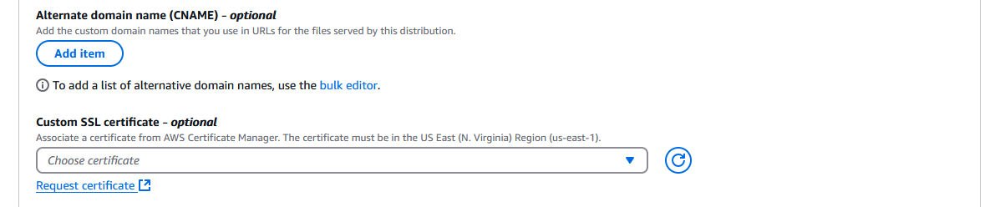

2. Leave the "Request a public certificate" option in place and click "Next."

3. Write the **Fully qualified domain name** (e.g. subdomain.domain.com) that will be used to point to the CDN. Add more if necessary.

3. Leave all other options alone and click "Request" on the bottom right.

4. Click the "Certificates" breadcrumb on top and click on the name of the newly created certificate. It should still have the status "Pending validation". We are going to take care of that now.

5. Under the **Domains** box, for each of the listed domains, there will be a **CNAME name** and a **CNAME value**. Scroll all the way to the right if the browser isn't wide enough. Take note of these.
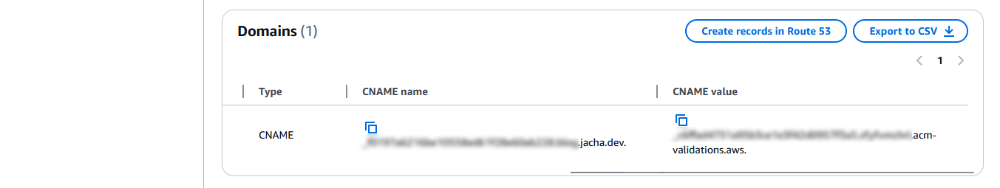

6. Amazon's certificate manager needs to test if we in fact own the domain name we specified, for security purposes. We need to add a _CNAME_ record at the _domain name service (DNS)_. Since I'm using Porkbun, the description will be of that here. However, I've used AWS Route53 and the one on Blue Host, and the steps won't be far off. On Porkbun's list of domains, we hover our mouse over the domain name we wish to set up, and click on the "DNS" link tha appears.
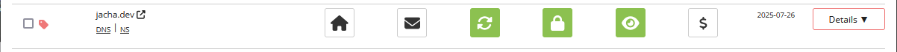

7. Once in Porkbun's **Manage DNS Records**, under **Type** we select "CNAME - Canonical name record". Then we enter the "CNAME name" from AWS to **Host**, making sure to leave out the domain and top-level domain part; also copy "CNAME value" from AWS to **Answer / Value**. Press "Add" on the bottom right and we should see the record listed on the bottom.
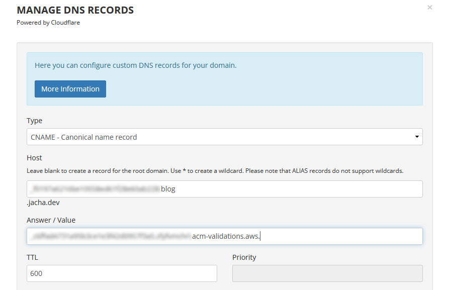

8. If there's a preexisting _ALIAS_ or _CNAME_ record with **Host** "*.domain.com" and **Answer** "pixie.porkbun.com" or something similar, delete it by clicking the trash can icon to the right. This wildcard record might conflict with the CNAME one we just created. (But _don't_ delete the ALIAS on the root domain "domain.com".)

9. Head back to AWS Certificate Manager and wait a few minutes, then refresh the browser. The status should change from "Pending validation" to "Success" very soon.

### Create a Cloudfront distribution
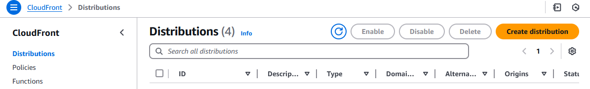

1. Close the tab and return to creating the Cloudfront distribution. On the top, under **Origin domain**, select the S3 bucket we created earlier from the dropdown. A warning might then pop up asking us to the the S3 website endpoint instead of the bucket endpoint. Press the "Use website endpoint" button to accept.
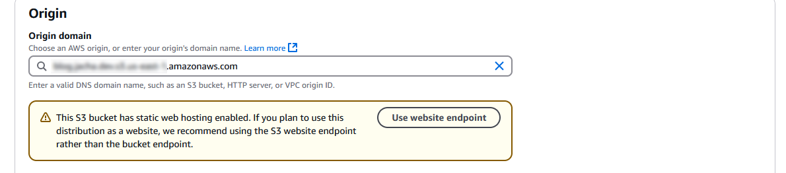

2. Select these option and leave the others alone.
- **Viewer protocol policy**, I suggest "Redirect HTTP to HTTPS". There's really no reason to allow HTTP if HTTPS is available.
- **Allowed HTTP methods** should be "GET, HEAD, OPTIONS" so that a _preflight request_, which asks the host what headers are supported, could be accepted. Without OPTIONS, we might get a lot of HTTP 403 errors.
- **Cache policy** should be "CachingOptimized", which AWS recommends for S3, as it should say if the S3 bucket was selected.
- **Origin request policy - _optional_**, select "CORS-S3Origin". This creates _cross origin resource sharing (CORS)_ headers. This is needed for things like calling other APIs, loading web fonts or any resource from another domain, etc.
- **Response headers policy - _optional_**, select "CORS-with-preflight-and-SecurityHeadersPolicy". This deals with CORS and preflight, and it gives us some security headers, such as "SAMEORIGIN" for X-Frame-Options, or blocking cross-site scripting. CORS and preflight can be a headache to work with, in my opinion, so it's nice that we get it for free.
- **Web Application Firewall (WAF)**. "Do not enable security protections." Or enable it if security vulnerabilities and denial of service are worrisome, but be prepared to pay at least $8 per month even with no traffic.
- **Price class** under **Settings**, choose "North America and Europe" or the third option if you want to potentially save some money (although it's probably negligible regardless). This would decrease the amount of edge locations of the CDN to cache content. It would increase response time for certain parts of the world.
- **Custom SSL certificate - _optional_** must be selected before **Alternate domain name (CNAME) - _optional_** can be selected. Just select the ACM certificate that we created earlier.
- **Alternate domain name (CNAME) - _optional_**, click "Add item" and add the fully qualified domain names (e.g. subdomain.domain.com).
- **Suported HTTP versions**, select "HTTP/3" (both of them should be selected). Popularity is increasing. [33.7% of websites use HTTP/3](https://w3techs.com/technologies/details/ce-http3) as of Jan. 2025. So why not?
- **IPv6**, select "On". It's still not as prevalent as IPv4, but adoption is growing. A bit [under 50% of Google users use it](https://en.wikipedia.org/wiki/IPv6_deployment).

3. Click "Save changes" on the bottom right.

### Connect the domain

1. Click back to the distribution, and under the "General" tab on top, copy the **Distribution domain name**.

2. Switch back to Porkbun's **Manage DNS Records** page. This time create a new _ALIAS - CNAME flattening record_ under **Type**. Under **Host**, enter the subdomain or leave it blank to use the root domain. For example, if we want to use www.domain.com, enter "www". If we want to use blog.domain.com, enter "blog". If we want to use domain.com, leave it blank. Finally, under **Answer / Value**, enter the Cloudfront distribution domain name that was copied.

3. Again, click "Add", and it should appear on the "Current Records" list on the bottom. Now if we visit our subdomain.domain.com, we should see that it works with "https://" as the protocol.

## Restrict traffic to go through Cloudfront only

We have a Cloudfront distribution with HTTPS set up, that allows us to deliver the content to edge servers closer to the users, decreasing cost and increasing loading and bandwidth speed. We have also pointed our domain name at it. Everything works great, but is that it? 

The problem is that if the blog readers somehow get their hands on the S3 bucket URI, then they could still bypass HTTPS through Cloudfront and all of its security options. Bypassing the CDN might also make the site respond slower and increase costs. Moreover, since the CDN caches a version of the site, there's the possibility that users could be access two different live versions of the site, leading to unpredictable behavior if there are any database updates. Thankfully, at least for now, the site is fully static. But it's a good idea to tie up any loose ends.

So our goal is to for all intents and purposes disable the S3 URI, route all traffic through Cloudfront and to our custom domain, and prevent any unauthorized linking directly to the S3 bucket. The first task then would be to turn off static hosting and restrict the bucket policy. Next, we would have to configure Cloudfront with _origin access control (OAC)_ so that only the distribution is permitted to access the S3 origin. Lastly, we would need to create a Cloudfront function to handle a little discrepancy between how Cloudfront and S3 views the object names.

### Restrict S3 access
The domain we had set up worked beautifully, but now we're going to break it temporarily so we can reconfigure it to be more secure.

1. In the bucket page, we click on the "Properties" tab on the nav bar up top, then scroll all the way to the bottom to **Static website hosting**. This time we're going to press the "Edit" button and disable it.

2. Then we go to the "Permissions" tab on the nav bar, and scroll part way down to **Bucket policy**. Previously, we had set up a policy to allow anyone read access to resources in our bucket. Now we're going to make sure that only Cloudfront has access to these resources, specifically only distributions matching an _Amazon resource name (ARN)_ that's the same as the one we created. So press the "Edit" button at the top of the policy.
```json
{
    "Version": "2012-10-17",
    "Statement": [
        {
            // [!code annotation] Arbitrary name to describe the policy.
            "Sid": "PublicGetObject", // [!code --]
            "Sid": "CloudfrontServiceGetObject", // [!code ++]
            "Effect": "Allow",
            // [!code annotation] Allow only Cloudfront as a service to access the resource instead of anyone at all, as previously indicated by the wildcard. However, with just this change it would still be possible for a malicious user to create an alternate distribution to access the bucket.
            "Principal": "*", //[!code --]
            "Principal": {//[!code ++]
                "Service": "cloudfront.amazonaws.com"//[!code ++]
            }, //[!code ++]
            "Action": "s3:GetObject",
            // [!code annotation] We add a condition such that the source ARN has the same name as the distribution we created. The name can be found under "ARN", under the "General" tab in the Cloudfront distribution's page.
            "Resource": "arn:aws:s3:::blog.jacha.dev/*" //[!code --]
            "Resource": "arn:aws:s3:::blog.jacha.dev/*", //[!code ++]
            "Condition": { //[!code ++]
                "StringEquals": {//[!code ++]
                    "AWS:SourceARN": "arn:aws:cloudfront::123456789012:distribution/ABCDEFGHIJKLM" //[!code ++]
                }//[!code ++]
            }//[!code ++]
        }
    ]
}
```
<cite>[Restricting access to S3 using Cloudfront](https://docs.aws.amazon.com/AmazonCloudFront/latest/DeveloperGuide/private-content-restricting-access-to-s3.html)</cite>

Note that using SourceARN as opposed to PrincipalARN prevents the [Confused Deputy Problem](https://docs.aws.amazon.com/IAM/latest/UserGuide/confused-deputy.html).

3. Press "Save changes" at the bottom.

## Origin access control at Cloudfront
The following section is a little bit obscure, since in the past several years AWS has changed how this works at least a couple times. There used to be an _origin access identity (OAI)_, that was mysteriously removed from the panel one day in favor of OAC. But even then the settings have since changed appearances at least once or twice. At the time of this post, it seems Stack Overflow had been in disarray over the past years, with multiple responders giving outdated advice.

1. First thing's first, since we disabled web hosting at the S3 bucket, it no longer has a website endpoint. Therefore, we should click the "Origins" tab on the nav bar in the distribution page, select our origin (which is our S3 bucket) under "Origins", and then press "Edit". Under **Origin domain**, make sure the bucket endpoint for the bucket is selected, instead of a website endpoint that no longer works. 

2. A bit lower, there's an **Origin access** section which has strangely been missing from the "Create distribution" process. Change the selection from "Public" to "Origin access control settings (recommended)". Under **Origin access control**, press "Create new OAC".
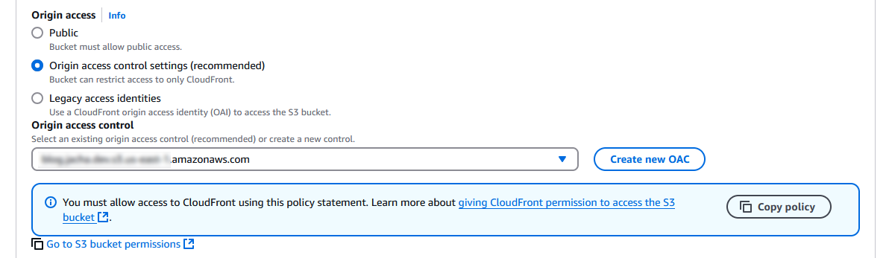

3. Under **Name**, enter the bucket endpoint, which is in the form of `<bucket-name>.s3.<region>.amazonaws.com{:js}` if a direct reference can't be found. **Signing behavior** should be "Sign requests (recommended)". Press "Create".
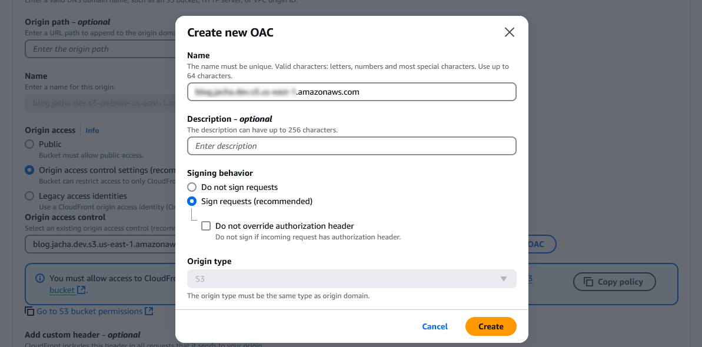

4. Back in **Edit origin**, select the new OAC that was just created. The blue box underneath gives us the S3 bucket policies that we already changed. Press "Save changes" on the bottom right.

5. Go to "Behaviors" on the nav bar and click that. Again, under **Edit behavior**, make sure **Origin and origin groups** have the right bucket endpoint URI. Then scroll all the way down and press "Save changes" for now.

## Cloudfront function to add default object to requests

Until the last few steps, if we tried using our Cloudfront URI or our custom domain, we should have encountered an Error 403, "Access Denied" due to S3 not allowing public access anymore, and Cloudfront being improperly set up. After properly setting up Cloudfront, we should encounter Error 404, "Not Found" or something similar. This is actually proof that this is _working_, that we have been granted access but the resources can't be found.

The mishap lies in a combination of factors. First, Astro (and other popular JS frameworks) use file-based routing, probably popularized by Next.js 13. That is, the framework ends up with routes that look like `blogs/my-blog-name/index.html{:shell}` instead of `blogs/my-blog-name.html{:shell}`. Since `index.html{:shell}` is usually interpreted as the "default object", the user enters just `blogs/my-blog-name/{:shell}` into the browser expecting to retrieve the HTML file. As a security feature, Cloudfront tries to prevent users from unnecessary peering into files in the directory that aren't directly named, so it sends `blogs/my-blog-name/{:shell}` as is to the S3 bucket, and S3 doesn't recognize it since it only has an object named `blogs/my-blog-name/index.html{:shell}`. So it returns an Error 404.

1. We could go into the "General" tab of the nav bar in the distribution settings and press "Edit" on the right side of the **Settings** panel. If we scroll down near the bottom, we'd find a **Default root object - _optional_**, in which we could enter `index.html` so it recognizes that as the default. But it only recognizes it as the default object on the _root_. After pressing "Save changes" and refreshing the Cloudfront distribution URI or our custom domain, we'd see that it works! _But_ clicking on any link brings us back to a 404.

This is the point in which many on Stack Overflow resort to reverting back to S3 static hosting, or some legacy setting, or some other option with undesirable side effects. In 2017, AWS introduced Lambda@Edge functions serverless functions that are run from Cloudfront. It's not expensive per se, but it doesn't have a free tier. Then in 2021, they introduced Cloudfront Functions ([see differences](https://docs.aws.amazon.com/AmazonCloudFront/latest/DeveloperGuide/edge-functions-choosing.html)) that have a generous 2 million invocation free tier. These are sub-millisecond functions dedicated to small manipulations of request headers or URL redirects -- perfect for our application!

2. Click on the hamburger icon next to "Cloudfront" to open up the menu on the left. Click on "Functions". Then, "Create function".
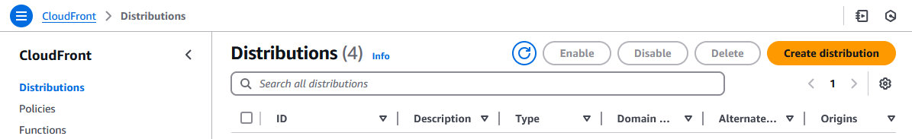

3. Enter a descriptive **Name** and **Description**, then select "cloudfront-js-2.0" that supports newer JS methods. Press "Create function".

4. Under **Development**, we want to write code to add `index.html` at the end of each request path with just a directory. While this isn't hard to derive, Ronnie Eichler has [blog on AWS](https://aws.amazon.com/blogs/networking-and-content-delivery/implementing-default-directory-indexes-in-amazon-s3-backed-amazon-cloudfront-origins-using-cloudfront-functions/) that describes the issue at hand and includes code for a solution. I've reproduced it here.
```javascript

function handler(event) {
    var request = event.request;
    var uri = request.uri;

    // Check whether the URI is missing a file name.
    if (uri.endsWith('/')) {
        request.uri = 'index.html';
    }
    // Check whether the URI is missing a file extension.
    else if (!uri.includes('.')) {
        request.uri += '/index.html';
    }

    return request;
}
```
<cite>[Implementing Default Directory Indexes in Amazon S3-backed Amazon CloudFront Origins Using CloudFront Functions](https://aws.amazon.com/blogs/networking-and-content-delivery/implementing-default-directory-indexes-in-amazon-s3-backed-amazon-cloudfront-origins-using-cloudfront-functions/)</cite>

I highly recommend reading this blog for anyone interested in a deeper dive of this issue.

5. After writing the function, click on "Publish" on the nav bar above, and press "Public function". Then press on "Add association" at the bottom of the page.
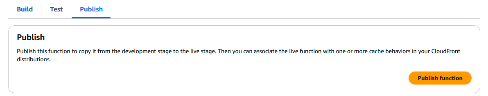

6. Under **Distribution**, select the Cloudfront distribution. Leave **Event type** as "Viewer request". The **Cache behavior** only has one option, which is "Default (*)". Press "Add association" again. If we click back to the distribution's "Edit behavior" page, we can see that it has automatically added function associations to the distribution.
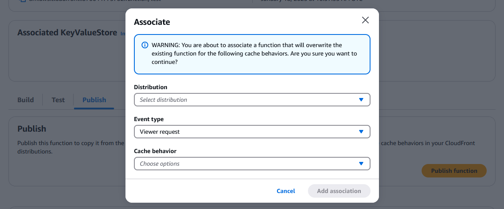

7. Finally, it will take several minutes for the distribution to redeploy with the function association. Wait for the status to turn from "Deploying" back to "Enabled", then test the Cloudfront distribution URI and domain URI again. If everything went according to plan, they should both work, including all the subdirectories.
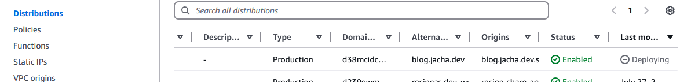

However, if we try the S3 bucket URI again, we should get an "Access Denied" XML from an Error 403.
```xml
<Error>
    <Code>AccessDenied</Code>
    <Message>Access Denied</Message>
    <RequestId>VKT4D7N697Q1YK9P</RequestId>
    <HostId>
        yDIxASaLtFNzzcMOoqGmbmwuVZ1oMZoaqGp6lPOSy6CYLVRL39ypNCZpkh2iFubsqtBuZGp0Qtg=
    </HostId>
</Error>
```

## Recap

In the previous Part, we ended up with the site hosted on a public file server, connected to a custom domain registered on Porkbun. Throughout Part 2, we have created a Cloudfront CDN distribution to deliver the site content from edge nodes closer to the readers. It supports HTTPS, _and_ through _origin access control_ we are able to restrict access to the S3 bucket through just Cloudfront. This prevents malicious users or just inadvertent following of links directly to the bucket, circumventing all the security, logging and analysis features of Cloudfront. Therefore, the end result is safer, faster, and likely less expensive.

In Part 3, the next and final part of the series, we will discuss how to upload files to the bucket without going through the browser. We will use a console, and be able to sync newly built versions of the site from our local development environment to the S3 bucket, adding and deleting only files that have been changed. This will limit our GET and PUT requests even more.