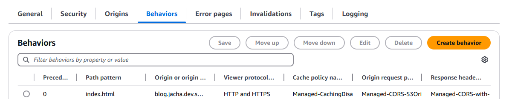
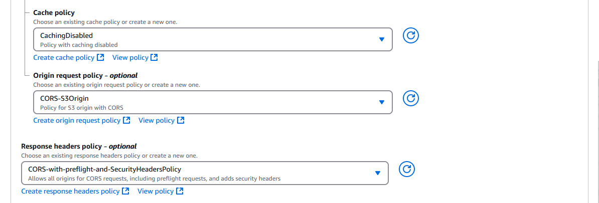

After several updates to the S3 bucket, we might realize that styling often break, and sometimes links. This is in part due to Astro adding hashes to the end of static files such as styles or scripts, but not HTML documents. This is also due to Cloudfront's default caching of a day, such that all the assets update immediately due to having different names, while the HTML documents with the same name remain the prior version that link to outdated assets. This can be solved in several ways:
1. **Object versioning with query parameters** is what Amazon recommends, tagging a custom query string at the end of every file referring to its version number, then storing multiple versions in S3 buckets. Storing _multiple_ versions, of course, makes AWS the most money.
2. **Object versioning with file names** instead adds a version number or often a hash of the file contents. This works well for assets like styles and scripts, since these links are often out of view and hidden somewhere in the HTML. However, tacked to the end of HTML file paths, they not only look a bit ugly, but also makes it hard to bookmark an endpoint for a long time (since version changes also change file names). Typically sites use this for just assets, and they can get away with it by using a combination of Cache-Control headers from the origin server. However, this is harder for us since we're using a static site.
3. **Cache control through Cloudfront**, using behaviors and functions and might increase cost in the long run. But for small sites like a static blog, this might as well be the _loooooong_ run.

This post will cover some of (2) and (3).

## Setup

First, we can turn the Astro build format to "preserve". By default using "directory" as the build format, whether we have `path/file.astro{:shell}` or `path/file/index.astro{:shell}` in our contents, it builds to `path/file/index.html{:shell}`. With "preserve", `path/file.astro{:shell}` builds to `path/file.html{:shell}`, and `path/file/index.astro{:shell}` builds to `path/file/index.html{:shell}`. This distinction might make it easier to pattern match some things.
```typescript title=/astro.config.ts; start-line=10; highlight=[14-16]
export default defineConfig({
    site: SITE_URL,
    integrations: [sitemap(), svelte()],
    markdown: markdownConfig,
    build: {
        format: 'preserve'
    }
});
```

It might also be a good idea at this time to alter the `pages` structure a bit.
```plaintext
pages
    // [!code annotation] This will be the path to our blog posts.
    [slug].astro
    // [!code annotation] This will be the path to our list of blogs.
    [...page].astro // [!code --]
    [...page] // [!code ++]
        index.astro // [!code ++]
```
The plan is to let blog posts build to `/blogs/my-blog-post.html{:shell}` for example, and the browse page build to `/tags/my-tag/index.html{:shell}`.

## A couple options

### Option: Hash at the end of file names

If we make append the hash of a file's contents, then when we sync to S3 with `aws s3 sync --size-only{:shell}`, ignoring Astro's propensity to update even untouched files, then it would only update the files when the contents have changed. On top of that, it would allow the CDN to work ideally with a long _time to live (TTL)_ cache, yet still update immediately when new updates are pushed. Perfect solution, right? Except that now we'd be left with some unmemorable hashes at the end of each path that are hard to type and hard to bookmark -- probably hard to remain Google search results if they change with any frequency.

In any case for example, we can change the file structure to
```plaintext
pages
    // [!code annotation] This will be the path to our list of blogs.
    [...page]
        index.astro // [!code --]
        [hash].astro // [!code ++]
```
 update the getStaticPaths function for the blog list to
```typescript title=/src/pages/[...page]/[hash].astro; dir-level-fade=2; start-line=11; highlight=[14-16]
import { xxHash32 } from 'js-xxhash';
export const getStaticPaths = (async ({ paginate }) => {
	const posts: BlogPost[] = (await getCollection('blog')).sort(sortByDateDesc);
    const hash = xxHash32(posts
        .map((post) => post.rendered?.html || post.data.title)
        .join('\n'), seed=0);
	return paginate(posts, {
        params: { hash },
		pageSize: 10
	});

}) satisfies GetStaticPaths;
```
Now every time we add a new blog post, the blog index will change, the list of blog contents will change, and the hash will change, giving it a new file name. This new file name gets uploaded to the S3 bucket, and is recognized by the CDN immediately due to the change in name. However, if we don't update for a whole year, then we could potentially set the cache to infinite time.

### Option: Disable caching with path patterns

The second strategy is to disable caching that will change on every update, like the index/listing page. This would increase cost somewhat, since page hits would incur an extra call to the bucket every time. However, with path patterns, caching could still be in place for images, CSS styles and scripts, which are probably the larger files and less often changed. Since Astro adds hashes to these assets by default, and they aren't directly referenced on the browser address, they're not an issue. 

First, we'll need to go to our Cloudfront distribution, to "Behaviors", and "Create behavior".


The **Path pattern** should be `.html`, or with the way it's set up earlier, `index.html` to target the index/listing pages. By not specifying directories (with "/"), this actually will target every file with the pattern specified.


Most of everything else can be as it was originally set up in the distribution. I have
- **Viewer protocol policy:** Redirect HTTP to HTTPS
- **Allowed HTTP methods:** GET, HEAD, OPTIONS (this is to deal with preflight requests)
- **Restrict viewer access:** No
- **Cache key and origin requests:** Cache policy and origin request policy (recommended)

Here, **Cache policy** needs to be set to _CachingDisabled_, or a custom policy needs to be created to that effect, which is the legacy cache settings that is more commonly described on Stack Overflow. But with the newer settings, we have some templates to choose from.


**Origin request policy** can be _CORS-S3Origin_ so that web fonts, APIs, or anything with other domains could be loaded. **Response headers policy** can be _CORS-with-preflight-and-SecurityHeadersPolicy_, which has some policies protecting against cross site scripting (XSS), and allowing cross-origin resource sharing (CORS) requests.

Then we "Create behavior" at the bottom of the page, and Cloudfront should skip caching files named `index.html`, allowing us to update CSS files without breaking styling on the default root resource, or add new blog posts without the index pages breaking for a day, or however long the TTL is set to. The small cost increase is worth not having a broken site 2 days a week, in my opinion.

## Other options?

There is the possibility to turn on **Object versioning** in the S3 bucket, allowing it to store multiple versions of every object. The number of non-current (outdated) versions could be controlled by a **Lifecycle policy**, including the number of days a version takes to become non-current. But then a **Cache policy** needs to be created in Cloudfront to add the `?versionId={:http}` query string, passing the version ID to S3 of the object to retrieve. How would we know the version ID? Presumably, we'd need to call `aws s3api get-bucket-versioning --bucket my-bucket-name{:shell}` from Astro, replacing all the links with that query string. But first we'd have to update the **Bucket policy** to allow the "Action" _s3:GetObjectVersion_.

Alternatively, we could store a local variable called `VERSION` in some settings file. Then when we would call something like `aws s3 sync ./dist s3://my-bucket-name/<VERSION>{:shell}` to sync the files to a new copy of all the files in the S3 bucket. Then we'd increment `VERSION` and call `aws update-distribution -- distribution-config` with a JSON structure, updating the **Origin path** to the directory holding the new version.
```json highlight=[14]
{
    "CallerReference": "string",
    "Aliases": {
        "Quantity": integer,
        "Items": ["string", ...]
    },
    "DefaultRootObject": "string",
    "Origins": {
        "Quantity": integer,
        "Items": [
            {
                "Id": "string",
                "DomainName": "string",
                "OriginPath": "string",
                //...
            }
        ]
    }
}
```
Both of these are too complicated right now, for whatever benefit they confer. Maybe I'll set this up properly some years later when I have a few hundred posts and half a dozen readers. Until then, I'm not going to prematurely optimize too much...